# Portfolio Project 1 - HTML/CSS Essentials

Smooth!e is a website for everybody in the world who loves smoothies. On this website you can both find new lovely recipes to explore and also share your favourite recipe with the world. So very welcome to explore some of the best smoothies in the world!

## Live Site
[Go to site](https://williamtyn.github.io/smoothies/) 

## Repository
[View repository](https://github.com/williamtyn/smoothies) 

## Catalouge
<ul>
<li><a href="#target-group">Target Group</a></li>
<li><a href="#site-structure">Site Structure</a>
<ul>
<li><a href="#homepage">Homepage</a></li>
<li><a href="#recipe-page">Recipes Page</a></li>
<li><a href="#share-smoothie">Share Smoothie Page</a></li></ul>
<li><a href="#future-features">Future Features</a></li>
<li><a href="#testing">Testing</a></li>
<li><a href="#bugs">Bugs</a></li>
<ul><li><a href="#unsolved-bugs">Unsolved Bugs</a></li></ul>
<li><a href="#responsivness">Responsivness</a></li>
<li><a href="#technologies">Technologies</a></li>
<li><a href="#deployment">Deployment</a></li>
<li><a href="#credits">Credits</a></li>
<ul>
<li><a href="#code-issues">Issues with code</a></li>
<li><a href="#student-support">Student Support</a></li>
<li><a href="#images">Images</a></li>
<li><a href="#code">Code</a></li></ul>
<li><a href="#acknowledgements">Acknowledgements</a></li></ul>
</li>
</ul>

<h2 id="target-group">Target Group</h2>
This website targets the millions of people who want to find new smoothie recipes to test for their first time. The site is also for the people that have found their perfect recipe and want to share that with the world, along with getting traffic to their site.

<h2 id="target-group">Site Structure</h2>
Smoothie is a three page site that includes header with logo/navigation and footer with social icons on all pages for easy navigation. Because the user visit the site to mainly find new smoothie recipes i´ve focused a lot on many pictures to highlight the recipes so the user crave to test it.

<h3 id="homepage">Homepage</h3>

#### Hero Image With Text
A hero image along with ovelay text so the user fast can understand what the site is about and the purpose.

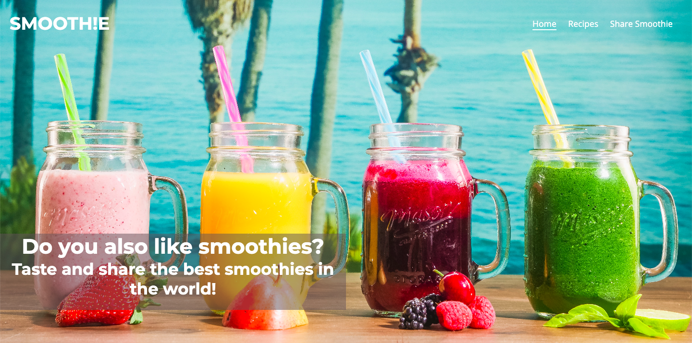

#### Advantages Of Drinking Smoothies
The homepage will show the main advantages of why you should drinks smoothies and with that motivate the user to test some of the recipes in the site.

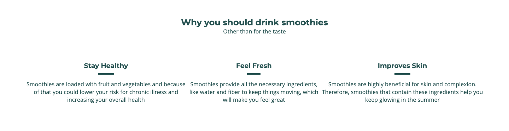

#### Some Of The Popular Recipes
In the homepage you can find some of the most popular recipes that the site will have.

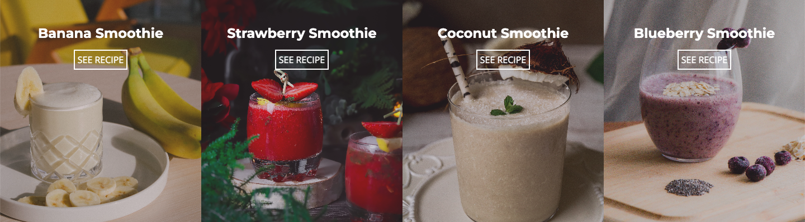

#### Footer
The footer remains in the bottom on all three pages and navigate the user to our social platforms. When the user clicks on the icon the browser will open a new page.

<h3 id="recipe-page">Recipe Page</h3>
The recipes page is the main purpose of the site where the visitor can see picture and recipe to many different smoothies. The first thing they see is a nice background to get their attention, followed by the different recipes and a link to the contributor of the recipe and their website.

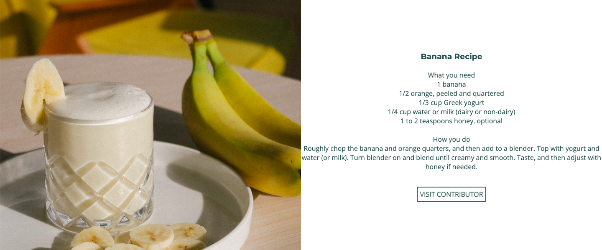
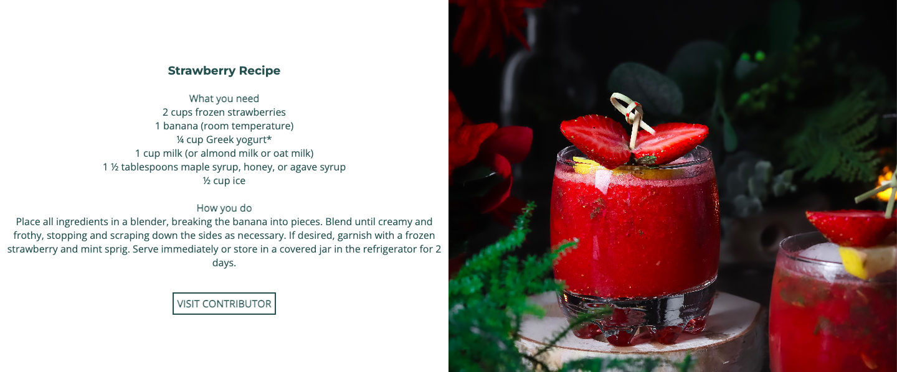

<h3 id="share-smoothie">Share Smoothie Page</h3>
On the share smoothie page you can find a form where you can send your information and the link to your site containing the recipe.

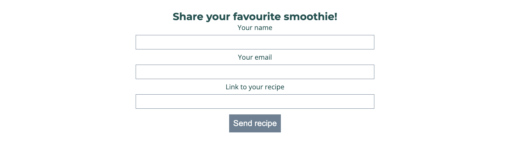

<h2 id="future-features">Future Features</h2>
<ul><li>Build Smoothie - A way for the visitor to list their ingredients they have at home and the site generate a smoothie recipe for them.</li>
<li>More Recipes - More content in the recipe page along with visitors contributing to the site.</li>
</ul>

<h2 id="testing">Testing</h2>
<ul> 
<li><a href="https://validator.w3.org/#validate_by_input" target="_blank" rel="noopener">HTML5 Validation</a> - Validated the HTML5 code</li> 
<li><a href="https://jigsaw.w3.org/css-validator/" target="_blank" rel="noopener">CSS Validation</a> - Validated the code</li>
<em>Comment - CSS was not passed at first due to my anchors that i used in buttons, therefore i removed the buttons and instead styled the anchor links</em>

<li><a href="https://web.dev/measure/" target="_blank" rel="noopener">Lighthouse</a> - See scoring below</li>
<em>Comment - after my first testing in lighthouse the score for website was very low due to high image sizes. Therefore i converted the files from jpg to webp and also made the file smaller without it effecting quality of the image, see tecnologies for which program was used.</em>
</ul>

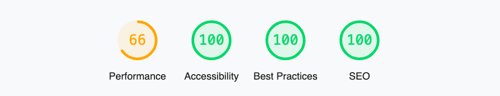

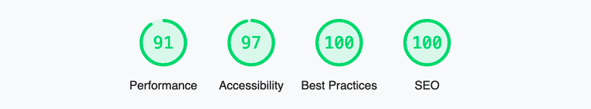

<h2 id="bugs">Bugs</h2>
As mentioned above i found that anchor didn´t go well witch button in html. I solved that by removing the button and instead styled the anchor links with css.

Also when validating HTML code i found som elements that didn´t had closing tags, which i resolved.

<h3 id="unsolved-bugs">Unsolved Bugs</h3>
1. There is a bug on the overlay text-div on background image for smaller screens. I made the display to none for the user to not be affected by it and if i had more time i would have made the code for the text-div to be responsive.

2. The form-submit-button now post the form to [formdump.codeinstitute.net](https://formdump.codeinstitute.net/) and with more time i had made a landing page within the site to thank the visitor for their contribution along with a button-link to redirect them back to the site.

<h2 id="responsivness">Responsivness</h2>
The responsive design was tested with . The testing of responsivness included Smartphones, Tablets and bigger screens. Media Queries was added in CSS for screens with 900px width and below.

<h2 id="technologies">Tecnhologies Used</h2>

* [HTML5](https://www.w3.org/TR/2014/REC-html5-20141028/introduction.html)- Used for the content and structure of site
* [CSS](https://www.w3.org/Style/CSS/Overview.en.html) - Used for styling of site
* [Google Fonts](https://fonts.google.com/) - Used for styling of fonts 
* [Font Awesome](https://fontawesome.com/) - Used for styling with icons
* [Chrome Dev Tools](https://developer.chrome.com/docs/devtools/) - Used for testing of different code, very used with creating responsiveness of site
* [Gitpod](https://www.gitpod.io/)- Creating and hosting of site
* [Github](https://github.com/)- Used to deploy the site
* [Multi Device Website Mockup Generator](https://techsini.com/multi-mockup/index.php) - Used to display homepage on different devices
* [Convertio](https://convertio.co/) - For converting jpg to webp for smaller file size

<h2 id="deployment">Deployment</h2>
The website was deployed to GitHub Pages.

### How the site was deployed

#### 1. Settings in GitHub repository
Go to <b>settings</b> in the GitHub repository of the site.

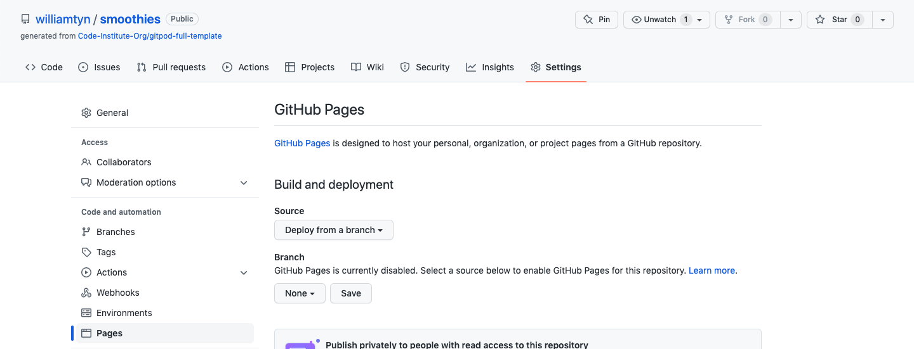

#### 2. Source and branch
Set the <b>source</b> to "Deploy from a branch".
Change the <b>branch</b> to "main" and .
Click "save".

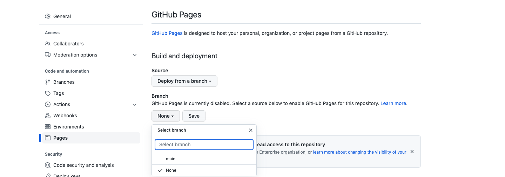

#### 3. Confirmation
Wait for confirmation that the source have been <b>saved</b>.

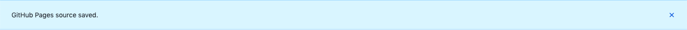

#### 4. Your site is live
It can take a few minutes before you can see your <b>link</b> to the hosted website.

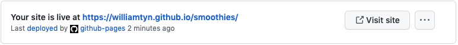

<h2 id="credits">Credits</h2>

<h3 id="code-issues">Issues with code</h3>

Many of my issues with both HTML5 and CSS was partly resolved thanks to [Stack Overflow](https://stackoverflow.com/) and [W3Schools](https://www.w3schools.com/).

<h3 id="student-support">Student Support</h3>

I had some problem with the sites hero image and thanks to Student Support at [Codeinstitute](https://codeinstitute.net/) i was able to resolve the problem.

<h3 id="images">Images</h3>

All the images on the site have been downloaded from [Pexels](https://www.pexels.com/sv-se/) and a special thanks to the image owners.

* [Kindel Media](https://www.pexels.com/sv-se/foto/smoothie-konserveringsburk-forfriskning-kalla-drycker-8181548/)
* [Vitaly](https://www.pexels.com/sv-se/foto/kafe-banan-smoothie-halsosam-mat-11712526/)
* [Ehioma Osih](https://www.pexels.com/sv-se/foto/glas-efterratt-dekoration-jordgubbe-10766779/)
* [Alexander Mils](https://www.pexels.com/sv-se/foto/mat-kall-halsosam-tra-1853812/)
* [Ralitsa Racheva](https://www.pexels.com/sv-se/foto/dryck-glas-frukt-blabar-11135665/)
* [Milada Vigerova](https://www.pexels.com/sv-se/foto/dryck-frukt-jordgubbar-farsk-5984486/)
* [Roman Odintsov](https://www.pexels.com/sv-se/foto/halsosam-dryck-metall-bord-4958863/)

<h3 id="code">Code</h3>
The code for the logo, navbar and footer was inspired from the Love Running Project.

<h2 id="acknowledgements">Acknowledgements</h2>
This website was completed as a Portfolio Project 1 for the Fullstack Diploma at <a href="https://codeinstitute.net/" target="_blank" rel="noopener">Codeinstitute</a>. The project was built due to my daily drinking of smoothies and my own searching for the best smoothie recipes, therefore is the concept real but the website is buit for my portfolio and not for public consumption. 

William Tynér, September 2022.